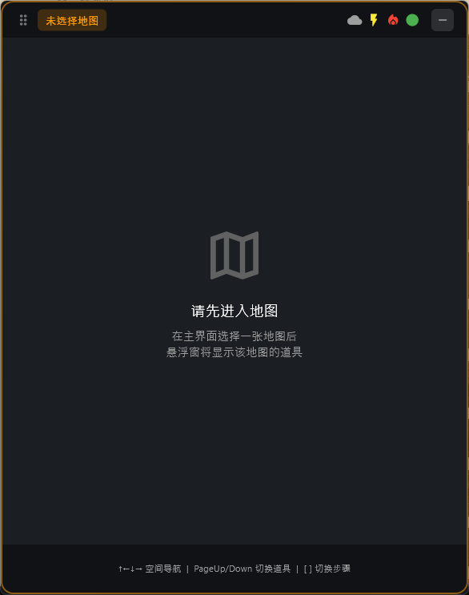
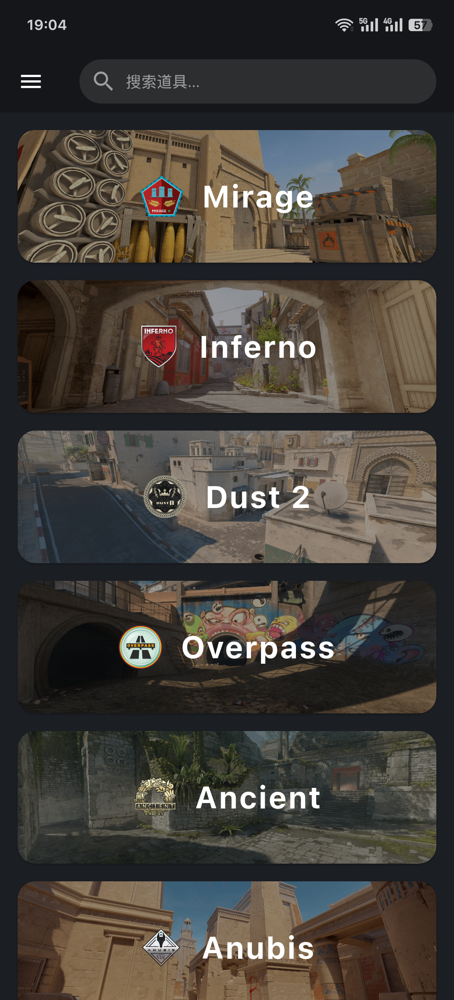
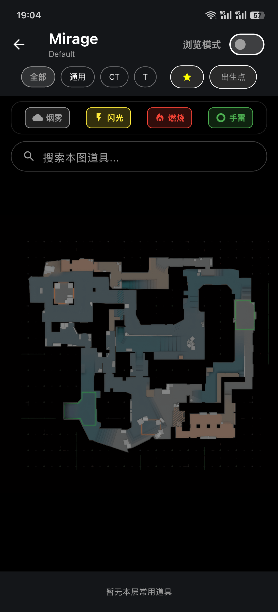
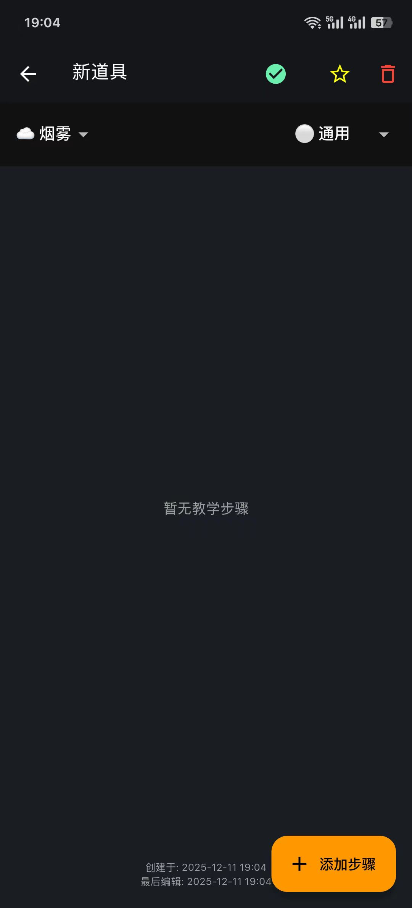

# Grenade Helper (CS2 投掷物助手)


**Grenade Helper** 是一款专为 **Counter-Strike 2** 玩家打造的现代化投掷物教学与辅助工具。不仅仅是简单的视频教学，更是你的实战好帮手。

核心亮点：**PC端独家 Overlay (画中画) 模式**，让你在游戏中一键呼出，无需切屏，即学即用！

---

## ✨ 核心功能 (Features)

*   🎮 **游戏内悬浮窗 (Overlay)**: 按下 `Alt + G` (默认) 即可呼出/隐藏。在死后或冻结时间快速查看点位，无需 Alt-Tab 切屏，不错过任何战机。
*   🗺️ **全地图覆盖**: 支持 Dust2, Mirage, Inferno, Nuke, Overpass, Ancient, Vertigo, Anubis 等主流竞技地图。
*   🎯 **全道具类型覆盖**: 烟雾弹 (Smoke)、燃烧瓶 (Molotov)、闪光弹 (Flash) 和手雷 (HE) 都包含在内。
*   📱 **多端互通**: 
    *   **PC**: 排位实战神器，Overlay 助你掌控全场。
    *   **Mobile (Android/iOS)**: 跑图练习、死斗模式时的最佳伴侣，躺在床上也能背道具。
*   📍 **出生点位 (Spawn Points)**: 全新功能！精准展示 CT/T 出生点位，帮助你开局扔道具快人一步。
*   🔎 **点位搜索**: 快速查找整张地图的道具或者在主页查找全部的道具。
*   🔗 **道具分享/导入**: 一键打包分享或者快捷导入他人分享的或者其他端的数据，方便又迅速，省去繁琐的手动添加。
*   🏦 **道具仓库（后续开放）**: 后续将会开放道具仓库供大家上传分享。

---

## 📸 预览 (Screenshots)

> *（建议在此处添加 Overlay 模式的游戏内截图 GIF 或图片）*

| 桌面端悬浮窗 | 手机版预览 | 地图详情 | 道具详情 |
|:---:|:---:|:---:|
|  |  |  |  |

---

## 🚀 下载与安装 (Installation)

### Windows
1.  前往 [Releases页面](../../releases) 下载最新的 `GrenadeHelper_Setup_x.x.x.exe`。
2.  运行安装程序完成安装。
3.  **注意**: 首次运行如果遇到杀毒软件误报，请添加信任。

### Android
1.  前往 [Releases页面](../../releases) 下载最新的 `.apk` 安装包。
2.  直接安装即可。

### iOS
1.  **AltStore (推荐)**: 下载 `.ipa` 文件，使用 AltStore 签名安装。
2.  **SideStore**: 支持免电脑续签。
3.  *详细教程请参考官网 Wiki*

---

## 📖 使用指南 (Usage)

### PC 悬浮窗模式
1.  启动 Grenade Helper。
2.  进入 CS2 游戏 (建议设置为 **【全屏窗口化】** 或 **【窗口化】** 以获得最佳 Overlay 体验，全屏独占模式下无法显示)。
3.  按下快捷键 **`Alt + G`** (可在设置中修改) 呼出/隐藏界面。

### 地图与筛选
*   在主页选择正在游玩的地图。
*   顶部标签栏筛选道具类型 (烟/火/闪/雷)。

---

## 🛠️ 开发与构建 (Development)

如果你是开发者，想贡献代码：

```bash
# Clone 仓库
git clone https://github.com/Invis1ble-2/grenade_helper.git

# 进入目录
cd grenade_helper

# 获取依赖
flutter pub get

# 生成代码 (Isar, JsonSerializable 等)
dart run build_runner build --delete-conflicting-outputs

# 运行 (Windows)
flutter run -d windows
```

---

## 🤝 反馈与贡献 (Feedback)

*   发现 Bug ？请提交 [Issue](../../issues)。
*   欢迎 Pull Request 贡献代码！

## 📄 许可证 (License)

本项目基于 MIT License 开源。
